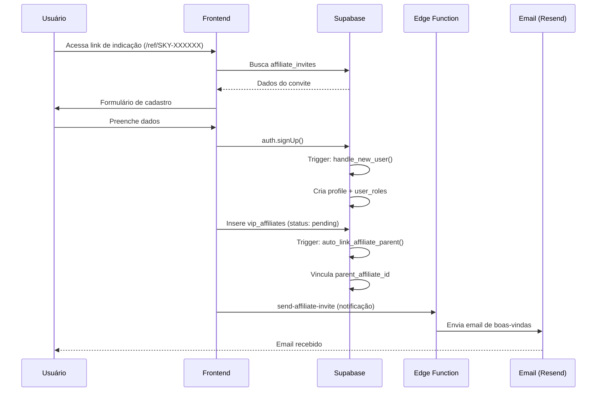
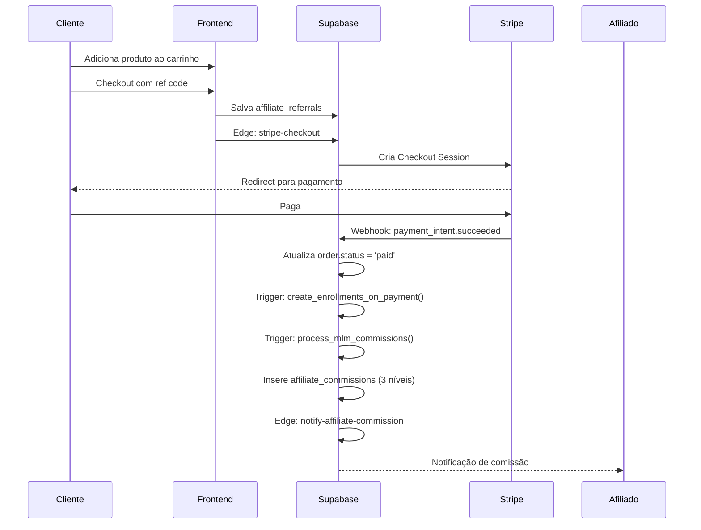

# 📚 Documentação Completa - Plataforma Rede Social VIP SkyInvestimentos

## Versão: 4.5.0 | Última atualização: Janeiro 2026

---

## 📋 Índice

1. [Visão Geral](#visão-geral)
2. [Arquitetura do Sistema](#arquitetura-do-sistema)
3. [Estrutura de Banco de Dados](#estrutura-de-banco-de-dados)
4. [Chaves e Integrações](#chaves-e-integrações)
5. [Edge Functions](#edge-functions)
6. [Módulos da Plataforma VIP](#módulos-da-plataforma-vip)
7. [Sistema de Afiliados MLM](#sistema-de-afiliados-mlm)
8. [Sistema de Vídeos Interno](#sistema-de-vídeos-interno)
9. [Integrações Externas](#integrações-externas)
10. [Fluxos de Dados](#fluxos-de-dados)

---

## 🎯 Visão Geral

A **Plataforma VIP SkyInvestimentos** é uma rede social completa para afiliados com sistema MLM (Marketing Multinível) de 2 níveis, marketplace de produtos digitais, sistema de vídeos interno, gamificação e comunidade integrada.

### Stack Tecnológico

| Camada | Tecnologia |
|--------|------------|
| Frontend | React 18 + TypeScript + Vite |
| Estilização | Tailwind CSS + shadcn/ui |
| Animações | Framer Motion + GSAP |
| Backend | Supabase (Lovable Cloud) |
| Edge Functions | Deno (Supabase Functions) |
| Banco de Dados | PostgreSQL |
| Armazenamento | Supabase Storage + Google Drive |
| Pagamentos | Stripe + PIX (EFI Pay) |
| Comunicação | WhatsApp API + Resend Email |

---

## 🏗️ Arquitetura do Sistema

```
┌─────────────────────────────────────────────────────────────────┐
│                        FRONTEND (React)                          │
├─────────────────────────────────────────────────────────────────┤
│  /vip/*           Área VIP (Dashboard, Rede, Blog, Loja)        │
│  /admin/*         Painel Administrativo                          │
│  /aluno/*         Área do Aluno (Cursos, Simulados)             │
│  /live/*          Sistema de Lives Interno                       │
│  /shorts          Feed de Vídeos Curtos                          │
└─────────────────────────────────────────────────────────────────┘
                              │
                              ▼
┌─────────────────────────────────────────────────────────────────┐
│                   SUPABASE (Lovable Cloud)                       │
├─────────────────────────────────────────────────────────────────┤
│  ┌─────────────┐  ┌─────────────┐  ┌─────────────┐              │
│  │  Auth       │  │  Database   │  │  Storage    │              │
│  │  (JWT)      │  │  (Postgres) │  │  (S3-like)  │              │
│  └─────────────┘  └─────────────┘  └─────────────┘              │
│  ┌─────────────┐  ┌─────────────┐                               │
│  │  Realtime   │  │  Edge Funcs │                               │
│  │  (WebSocket)│  │  (Deno)     │                               │
│  └─────────────┘  └─────────────┘                               │
└─────────────────────────────────────────────────────────────────┘
                              │
                              ▼
┌─────────────────────────────────────────────────────────────────┐
│                    INTEGRAÇÕES EXTERNAS                          │
├─────────────────────────────────────────────────────────────────┤
│  Stripe │ WhatsApp │ YouTube │ Google Drive │ ElevenLabs │ EFI  │
└─────────────────────────────────────────────────────────────────┘
```

---

## 🗄️ Estrutura de Banco de Dados

### Tabelas Principais do Sistema VIP

#### 1. `vip_affiliates` - Afiliados VIP
```sql
CREATE TABLE vip_affiliates (
  id UUID PRIMARY KEY DEFAULT gen_random_uuid(),
  user_id UUID NOT NULL REFERENCES auth.users,
  referral_code TEXT UNIQUE,                    -- Código de indicação (SKY-XXXXXX)
  parent_affiliate_id UUID REFERENCES vip_affiliates, -- Upline (MLM)
  invite_id UUID REFERENCES affiliate_invites,
  program_id UUID REFERENCES affiliate_programs,
  
  -- Status e Tier
  status TEXT DEFAULT 'pending',                -- pending, approved, rejected, suspended
  tier TEXT DEFAULT 'bronze',                   -- bronze, silver, gold, platinum
  commission_rate NUMERIC DEFAULT 10,           -- Taxa de comissão %
  
  -- Contadores
  referral_count INT DEFAULT 0,
  direct_referrals_count INT DEFAULT 0,
  total_earnings NUMERIC DEFAULT 0,
  team_earnings NUMERIC DEFAULT 0,
  total_sales INT DEFAULT 0,
  
  -- Creator
  is_creator BOOLEAN DEFAULT false,
  creator_enabled_at TIMESTAMPTZ,
  stripe_connect_id TEXT,
  stripe_connect_onboarded BOOLEAN DEFAULT false,
  
  -- Timestamps
  approved_at TIMESTAMPTZ,
  created_at TIMESTAMPTZ DEFAULT now(),
  updated_at TIMESTAMPTZ DEFAULT now()
);
```

#### 2. `affiliate_referrals` - Indicações
```sql
CREATE TABLE affiliate_referrals (
  id UUID PRIMARY KEY DEFAULT gen_random_uuid(),
  referrer_id UUID NOT NULL REFERENCES vip_affiliates,
  referred_user_id UUID,
  referred_email TEXT,
  order_id UUID REFERENCES orders,
  status TEXT DEFAULT 'pending',    -- pending, converted, expired
  converted_at TIMESTAMPTZ,
  created_ip TEXT,
  created_at TIMESTAMPTZ DEFAULT now()
);
```

#### 3. `affiliate_commissions` - Comissões
```sql
CREATE TABLE affiliate_commissions (
  id UUID PRIMARY KEY DEFAULT gen_random_uuid(),
  affiliate_id UUID NOT NULL REFERENCES vip_affiliates,
  order_id UUID REFERENCES orders,
  referral_id UUID REFERENCES affiliate_referrals,
  
  order_total NUMERIC NOT NULL,
  commission_rate NUMERIC NOT NULL,
  commission_amount NUMERIC NOT NULL,
  
  commission_level INT DEFAULT 0,        -- 0=direto, 1=MLM nível 1, 2=MLM nível 2
  commission_type TEXT DEFAULT 'direct', -- direct, mlm_level1, mlm_level2
  
  status TEXT DEFAULT 'pending',         -- pending, approved, paid, cancelled
  paid_at TIMESTAMPTZ,
  paid_via TEXT,
  pix_transaction_id TEXT,
  
  created_at TIMESTAMPTZ DEFAULT now()
);
```

#### 4. `affiliate_posts` - Posts da Comunidade VIP
```sql
CREATE TABLE affiliate_posts (
  id UUID PRIMARY KEY DEFAULT gen_random_uuid(),
  author_id UUID NOT NULL REFERENCES vip_affiliates,
  title TEXT NOT NULL,
  content TEXT NOT NULL,
  category TEXT,
  image_url TEXT,
  is_pinned BOOLEAN DEFAULT false,
  likes_count INT DEFAULT 0,
  comments_count INT DEFAULT 0,
  views_count INT DEFAULT 0,
  created_at TIMESTAMPTZ DEFAULT now(),
  updated_at TIMESTAMPTZ DEFAULT now()
);
```

#### 5. `videos` - Sistema de Vídeos Interno
```sql
CREATE TABLE videos (
  id UUID PRIMARY KEY DEFAULT gen_random_uuid(),
  user_id UUID NOT NULL,
  title TEXT NOT NULL,
  description TEXT,
  
  type TEXT DEFAULT 'video',     -- video, short, live
  status TEXT DEFAULT 'draft',   -- draft, processing, published, live, ended
  privacy TEXT DEFAULT 'public', -- public, students, vip, private
  
  -- Armazenamento
  storage_type TEXT DEFAULT 'internal', -- internal, drive
  video_url TEXT,
  thumbnail_url TEXT,
  hls_playlist_url TEXT,
  recording_url TEXT,
  
  -- Métricas
  duration INT,
  views_count INT DEFAULT 0,
  likes_count INT DEFAULT 0,
  comments_count INT DEFAULT 0,
  
  -- Live específico
  is_recording BOOLEAN DEFAULT false,
  live_started_at TIMESTAMPTZ,
  live_ended_at TIMESTAMPTZ,
  
  created_at TIMESTAMPTZ DEFAULT now(),
  updated_at TIMESTAMPTZ DEFAULT now()
);
```

### Diagrama de Relacionamentos

```
┌─────────────────┐      ┌─────────────────┐
│   auth.users    │──────│    profiles     │
└────────┬────────┘      └─────────────────┘
         │
         │ 1:1
         ▼
┌─────────────────┐      ┌─────────────────┐
│  vip_affiliates │──────│ affiliate_posts │
└────────┬────────┘      └─────────────────┘
         │
         │ 1:N (parent_affiliate_id = MLM)
         │
    ┌────┴────┐
    │         │
    ▼         ▼
┌─────────┐  ┌──────────────────┐
│referrals│  │   commissions    │
└─────────┘  └──────────────────┘
                    │
                    ▼
              ┌──────────┐
              │  orders  │
              └──────────┘
```

---

## 🔐 Chaves e Integrações

### Secrets Configurados (Supabase Vault)

| Nome do Secret | Serviço | Uso |
|----------------|---------|-----|
| `STRIPE_SECRET_KEY` | Stripe | Processamento de pagamentos |
| `STRIPE_PUBLISHABLE_KEY` | Stripe | Checkout frontend |
| `STRIPE_WEBHOOK_SECRET` | Stripe | Verificação de webhooks |
| `GOOGLE_CLIENT_ID` | Google | OAuth (Drive, Login) |
| `GOOGLE_CLIENT_SECRET` | Google | OAuth tokens |
| `YOUTUBE_API_KEY` | YouTube | Busca de vídeos |
| `WHATSAPP_ACCESS_TOKEN` | Meta | Envio de mensagens |
| `WHATSAPP_PHONE_NUMBER_ID` | Meta | ID do número |
| `WHATSAPP_BUSINESS_ID` | Meta | ID da conta business |
| `RESEND_API_KEY` | Resend | Envio de emails |
| `BREVO_API_KEY` | Brevo | Email marketing |
| `ELEVENLABS_API_KEY` | ElevenLabs | Text-to-Speech |
| `FACEBOOK_ACCESS_TOKEN` | Meta | Publicação social |
| `FACEBOOK_APP_ID` | Meta | App authentication |
| `FACEBOOK_APP_SECRET` | Meta | App authentication |
| `INSTAGRAM_ACCESS_TOKEN` | Meta | Publicação social |
| `INSTAGRAM_ACCOUNT_ID` | Meta | ID da conta |
| `META_SYSTEM_USER_TOKEN` | Meta | Token de sistema |
| `PIX_WEBHOOK_SECRET` | EFI Pay | Webhook PIX |
| `TWILIO_ACCOUNT_SID` | Twilio | SMS/Voz |
| `TWILIO_AUTH_TOKEN` | Twilio | Autenticação |
| `ADMIN_EMAIL` | Sistema | Email administrativo |
| `LOVABLE_API_KEY` | Lovable | IA interna |

### Variáveis de Ambiente (Frontend)

```env
VITE_SUPABASE_URL=https://wwxtqujohqsrcgqopthz.supabase.co
VITE_SUPABASE_PUBLISHABLE_KEY=eyJhbGciOiJIUzI1NiIs...
VITE_SUPABASE_PROJECT_ID=wwxtqujohqsrcgqopthz
```

---

## ⚡ Edge Functions

### Funções Principais

| Função | Descrição | Trigger |
|--------|-----------|---------|
| `stripe-checkout` | Cria sessão de pagamento | Checkout |
| `stripe-webhook` | Processa eventos Stripe | Webhook |
| `pix-webhook` | Processa pagamentos PIX | Webhook |
| `send-affiliate-invite` | Envia convite de afiliado | Ação admin |
| `notify-affiliate-commission` | Notifica comissão | Trigger DB |
| `google-drive-manager` | Gerencia arquivos Drive | Upload |
| `youtube-api` | Proxy YouTube API | Busca vídeos |
| `process-scheduled-posts` | Publica posts agendados | Cron (5min) |
| `chat-assistant` | IA de atendimento | Chat widget |
| `vip-slides-ai` | Geração de slides com IA | VIP Slides |
| `withdrawal-actions` | Processa saques | Solicitação |

### Exemplo de Edge Function (youtube-api)

```typescript
// supabase/functions/youtube-api/index.ts
import { serve } from "https://deno.land/std@0.168.0/http/server.ts";

const corsHeaders = {
  'Access-Control-Allow-Origin': '*',
  'Access-Control-Allow-Headers': 'authorization, x-client-info, apikey, content-type',
};

serve(async (req) => {
  if (req.method === 'OPTIONS') {
    return new Response(null, { headers: corsHeaders });
  }

  const YOUTUBE_API_KEY = Deno.env.get('YOUTUBE_API_KEY');
  const body = await req.json();
  
  // Implementação da API...
  
  return new Response(JSON.stringify({ success: true, data }), {
    headers: { ...corsHeaders, 'Content-Type': 'application/json' },
  });
});
```

---

## 📱 Módulos da Plataforma VIP

### Páginas e Componentes

| Rota | Arquivo | Descrição |
|------|---------|-----------|
| `/vip/dashboard` | `VIPDashboard.tsx` | Painel principal do afiliado |
| `/vip/network` | `VIPNetwork.tsx` | Rede de afiliados (MLM) |
| `/vip/network/blog` | `VIPBlog.tsx` | Comunidade/Blog VIP |
| `/vip/shop` | `VIPShop.tsx` | Loja de produtos |
| `/vip/cart` | `VIPCart.tsx` | Carrinho de compras |
| `/vip/checkout` | `VIPCheckout.tsx` | Finalização de compra |
| `/vip/referrals` | `VIPReferrals.tsx` | Minhas indicações |
| `/vip/materials` | `VIPMaterials.tsx` | Materiais de divulgação |
| `/vip/invites` | `VIPInvites.tsx` | Convidar afiliados |
| `/vip/withdrawals` | `VIPWithdrawals.tsx` | Solicitar saques |
| `/vip/bank` | `VIPBankSettings.tsx` | Dados bancários |
| `/vip/rewards` | `VIPRewards.tsx` | Sistema de pontos |
| `/vip/certificates` | `VIPCertificates.tsx` | Meus certificados |
| `/vip/creator` | `VIPCreator.tsx` | Painel Creator |
| `/vip/youtube` | `VIPYouTube.tsx` | Integração YouTube |
| `/vip/slides` | `VIPSlidesCreator.tsx` | Gerador de slides IA |
| `/vip/storage` | `VIPStorageManager.tsx` | Gerenciador de arquivos |

---

## 🔗 Sistema de Afiliados MLM

### Estrutura de Níveis

```
                    ┌─────────────────┐
                    │   PLATAFORMA    │
                    │   SKY (5-15%)   │
                    └────────┬────────┘
                             │
         ┌───────────────────┼───────────────────┐
         │                   │                   │
    ┌────▼────┐         ┌────▼────┐         ┌────▼────┐
    │ UPLINE  │         │ UPLINE  │         │ UPLINE  │
    │ Nível 2 │         │ Nível 2 │         │ Nível 2 │
    │  (2%)   │         │  (2%)   │         │  (2%)   │
    └────┬────┘         └────┬────┘         └────┬────┘
         │                   │                   │
    ┌────▼────┐         ┌────▼────┐         ┌────▼────┐
    │ UPLINE  │         │ UPLINE  │         │ UPLINE  │
    │ Nível 1 │         │ Nível 1 │         │ Nível 1 │
    │  (5%)   │         │  (5%)   │         │  (5%)   │
    └────┬────┘         └────┬────┘         └────┬────┘
         │                   │                   │
    ┌────▼────┐         ┌────▼────┐         ┌────▼────┐
    │ VENDEDOR│         │ VENDEDOR│         │ VENDEDOR│
    │ Direto  │         │ Direto  │         │ Direto  │
    │(10-30%) │         │(10-30%) │         │(10-30%) │
    └─────────┘         └─────────┘         └─────────┘
```

### Tiers e Comissões

| Tier | Comissão Direta | Requisitos |
|------|-----------------|------------|
| Bronze | 10% | Cadastro aprovado |
| Silver | 15% | 10 indicações OU R$3.000 vendas |
| Gold | 20% | 25 indicações OU R$10.000 vendas |
| Platinum | 30% | 100 indicações OU R$50.000 vendas |

### Fluxo de Comissão

```typescript
// Trigger: process_mlm_commissions()
// Executado quando order.status = 'paid'

1. Calcula comissão da plataforma (5-15%)
2. Calcula comissão do vendedor direto (10-30%)
3. Se MLM habilitado:
   - Busca parent_affiliate_id (Nível 1) → 5%
   - Busca parent do parent (Nível 2) → 2%
4. Insere registros em affiliate_commissions
5. Atualiza total_earnings e team_earnings
```

---

## 🎬 Sistema de Vídeos Interno

### Componentes Principais

| Componente | Arquivo | Função |
|------------|---------|--------|
| `VideoPlayer` | `src/components/video/VideoPlayer.tsx` | Player universal |
| `VideoUploader` | `src/components/video/VideoUploader.tsx` | Upload de vídeos |
| `ShortsFeed` | `src/components/video/ShortsFeed.tsx` | Feed vertical |
| `LiveStudio` | `src/components/video/LiveStudio.tsx` | Estúdio de live |
| `LiveViewer` | `src/components/video/LiveViewer.tsx` | Assistir live |
| `FloatingVideoButton` | `src/components/video/FloatingVideoButton.tsx` | FAB criar conteúdo |

### Rotas de Vídeo

| Rota | Descrição |
|------|-----------|
| `/shorts` | Feed de vídeos curtos (TikTok-style) |
| `/live/create` | Criar nova transmissão |
| `/live/:id` | Assistir live com chat |
| `/videos/upload` | Upload centralizado |
| `/videos/:id` | Visualizar vídeo |

### Armazenamento

```
Preferência: Google Drive (padrão)
├── Vídeos normais → Google Drive (ilimitado)
├── Shorts (até 60s) → Google Drive
├── Lives (gravação) → Supabase Storage (performance)
└── Fallback → Supabase Storage (15GB)

Bucket: videos
├── {user_id}/
│   ├── video_{timestamp}.mp4
│   ├── short_{timestamp}.mp4
│   ├── live_{timestamp}.webm
│   └── thumbnails/
│       └── thumb_{video_id}.jpg
```

---

## 🌐 Integrações Externas

### Stripe (Pagamentos)

```typescript
// Fluxo de Checkout
1. Frontend chama supabase.functions.invoke('stripe-checkout')
2. Edge function cria Checkout Session
3. Usuário paga no Stripe
4. Webhook recebe evento checkout.session.completed
5. Trigger cria enrollment + calcula comissões
```

### Google Drive

```typescript
// Fluxo de Upload
1. Verificar conexão: profiles.drive_connected
2. Se não conectado: chamar google-drive-manager?action=get-auth-url
3. Após OAuth: salvar tokens em profiles
4. Upload: google-drive-manager?action=upload
5. Criar pasta raiz: SkyInvestimentos/
```

### WhatsApp API

```typescript
// Envio de Mensagem
await supabase.functions.invoke('send-whatsapp', {
  body: {
    to: '+5548999999999',
    template: 'order_confirmation',
    parameters: ['João', 'SKY-123456', 'R$ 297,00']
  }
});
```

### YouTube API

```typescript
// Buscar Vídeos
await supabase.functions.invoke('youtube-api', {
  body: {
    action: 'search', // ou 'trending', 'live-broadcasts'
    query: 'investimentos',
    maxResults: 12
  }
});
```

---

## 🔄 Fluxos de Dados

### Fluxo de Cadastro de Afiliado



### Fluxo de Venda com Comissão



---

## 📊 RLS Policies (Row Level Security)

### Exemplo: vip_affiliates

```sql
-- Usuário vê próprio registro
CREATE POLICY "Users can view own affiliate" ON vip_affiliates
  FOR SELECT USING (auth.uid() = user_id);

-- Usuário pode criar próprio registro  
CREATE POLICY "Users can create own affiliate" ON vip_affiliates
  FOR INSERT WITH CHECK (auth.uid() = user_id);

-- Admin vê todos
CREATE POLICY "Admins can view all affiliates" ON vip_affiliates
  FOR ALL USING (public.has_role(auth.uid(), 'admin'));

-- Perfis públicos visíveis
CREATE POLICY "Public profiles visible" ON vip_affiliates
  FOR SELECT USING (status = 'approved');
```

---

## 🛠️ Manutenção e Troubleshooting

### Comandos Úteis

```sql
-- Recalcular contagem de indicações
SELECT * FROM recalculate_affiliate_referral_counts();

-- Vincular referrals órfãos
SELECT * FROM link_referrals_to_affiliates();

-- Corrigir links MLM
SELECT * FROM fix_mlm_parent_links();

-- Recalcular tier de afiliado
SELECT recalculate_affiliate_tier('affiliate-uuid-here');
```

### Logs de Edge Functions

```bash
# Via Lovable Cloud Dashboard
# Navegue para: Backend → Edge Functions → Logs
```

---

## 📝 Notas de Versão

### v4.5.0 (Janeiro 2026)
- ✅ Sistema de vídeos 100% interno (sem YouTube)
- ✅ Google Drive como armazenamento padrão
- ✅ Botão flutuante para criar conteúdo
- ✅ Feed de Shorts estilo TikTok
- ✅ Lives com chat em tempo real

### v4.0.0
- Sistema MLM de 2 níveis
- Painel Creator
- Stripe Connect para creators

### v3.0.0
- Rede social VIP
- Sistema de pontos e recompensas
- Comunidade com posts e comentários

---

## 📞 Suporte

- **Email Admin**: skyagencysc@gmail.com
- **WhatsApp**: Integrado na plataforma
- **Chat IA**: Widget no canto inferior direito

---

*Documento gerado automaticamente. Última atualização: Janeiro 2026*
